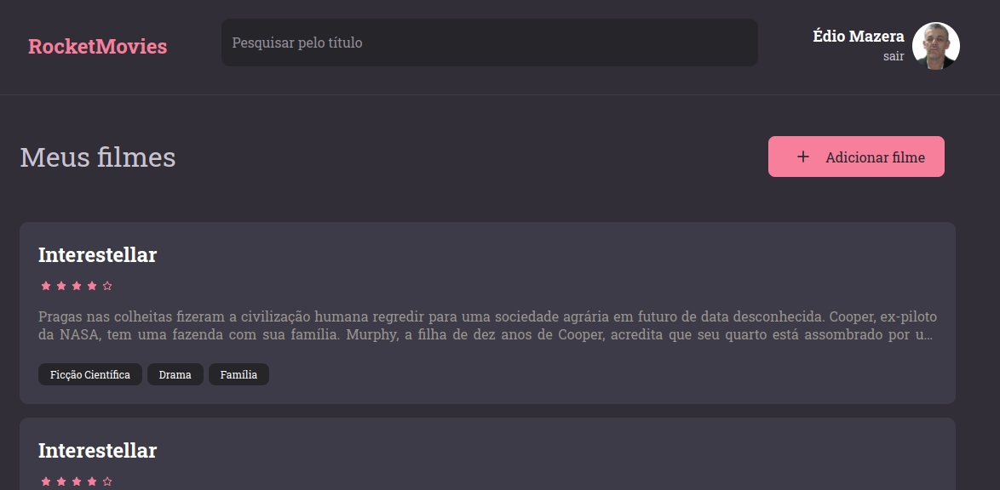

# Aplicação Frontend RocketMovies

- Instalar: `npm install`
- `npm install @vitejs/plugin-react`
- Rodar: `npm run dev`

- Figma - Rocket Movies: [RocketMovies](https://www.figma.com/file/Y7ugIg348l0w3DvU9MNTbv/RocketMovies?node-id=0%3A1)

- Cores

  ```
  BACKGROUND_900: "#262529",
  BACKGROUND_800: "#312E38",
  BACKGROUND_700: "#3E3B47",

      WHITE: "#FFFFFF",
      SALMON: "#FF859B",

      GRAY_100: "#CAC4CF",
      GRAY_300: "#948F99",

      RED: "#FF002E",

  ```

- Página de Login

  

- Criar sua conta

  

- Perfil

  

- Meus Filmes

  

- Novo Filme

  
